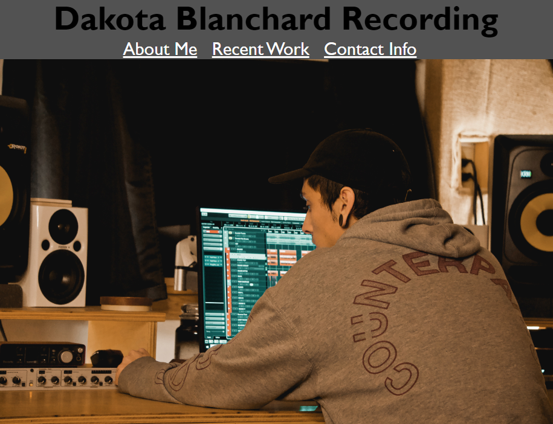
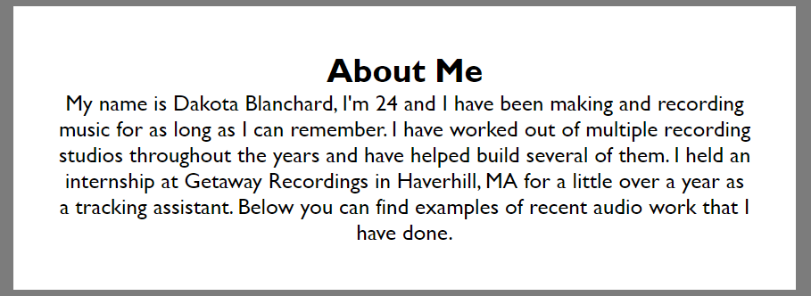
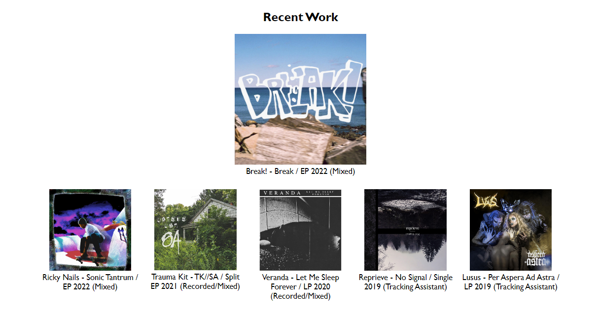
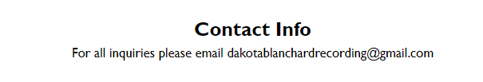

# Dakota Blanchard Recording Portfolio

The purpose of this site is to showcase my work to a potential client or employer.

Click [here](https://dakotablanchard.github.io/dbr-portfolio/) to launch the site.

The top of the site should look like the following image:

## Navigating the site:
Click on the "About Me" link in the navigation bar to be taken to a section with information about myself.

Click on the "Recent Work" link in the navigation bar to be taken to a section with links to recent audio work I've done.
Simply click on any album to be redirected to Spotify where you can listen to that album.

Click on the "Contact Info" link in the navigation bar to be taken to a section with links to recent ausio work I've done.

# Credits

[Making A Nav Bar Horizontal](https://www.w3schools.com/css/css_navbar_horizontal.asp)

[Creating A Nav Bar](https://www.youtube.com/watch?v=oLgtucwjVII)

[Making An Image Span The Page](https://stackoverflow.com/questions/12082913/with-css-how-do-i-make-an-image-span-the-full-width-of-the-page-as-a-background)

[Changing Link colors](https://www.youtube.com/watch?v=kWZ-8DA58nU)

[Making An Image A Link](https://www.tutorialspoint.com/How-to-use-an-image-as-a-link-in-HTML)

[Creating Hover Effect On Image Links](https://www.youtube.com/watch?v=Himo9n0BaDw)

[Centering Text With Image](https://stackoverflow.com/questions/1225130/how-can-i-align-text-directly-beneath-an-image)

[Hover Resize](https://www.w3schools.com/howto/howto_css_zoom_hover.asp)

[Media Queries](https://www.youtube.com/watch?v=2KL-z9A56SQ&t=180s)

[Screen Resize Issue](https://stackoverflow.com/questions/4612307/website-has-strange-whitespace-on-right-side-of-the-page-when-the-browser-is-res)

## License

Refer to the LICENSE file in the repo:

[License](https://github.com/dakotablanchard/dbr-portfolio/blob/main/LICENSE)